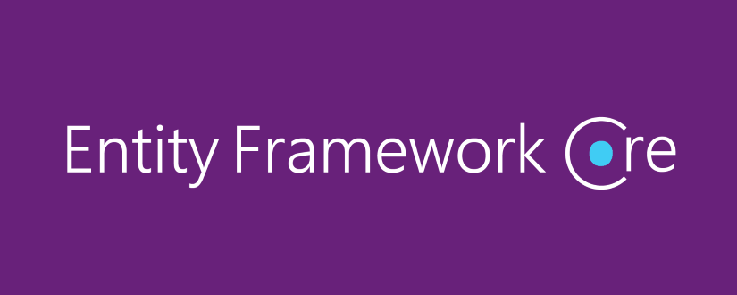

## Hi I'm Md. Ballal Hossain. 👋
<!---->
> I’m a Software Developer specializing in building Web & Desktop Applications. I love building Application Using ASP.NET 6+ (Windows Form,WPF, Web Form, MVC & CORE ) Framework.  As for the backend, I work with `ASP.NET Core WebAPIs` & `SQL` following Clean Architecture Principles. 

#### My Working Stack 💻
<!---->
       
<!--
**BelalDotNet/BelalDotNet** is a ✨ _special_ ✨ repository because its `README.md` (this file) appears on your GitHub profile.

Here are some ideas to get you started:

- 🔭 I’m currently working on ...
- 🌱 I’m currently learning ...
- 👯 I’m looking to collaborate on ...
- 🤔 I’m looking for help with ...
- 💬 Ask me about ...
- 📫 How to reach me: ...
- 😄 Pronouns: ...
- ⚡ Fun fact: ...
-->

## 📈 My GitHub Stats
### GitHub Stars

### Top Languages

### GitHub Streak

### GitHub Trophies

## 📫 You can find me @
<!-- YOU-CAN-FIND-ME:START -->
- [LinkedIn](https://www.linkedin.com/in/UniqueBelal/) 💼
- [Facebook](https://www.facebook.com/UniqueBelal) 😏
- [Twitter](https://twitter.com/UniqueBelal) 🐤
- [Instagram](https://www.instagram.com/UniqueBelal/) 😎
<!-- YOU-CAN-FIND-ME:END -->

**My Profile Visitor**(Counting since 26 Dec 2022): 
